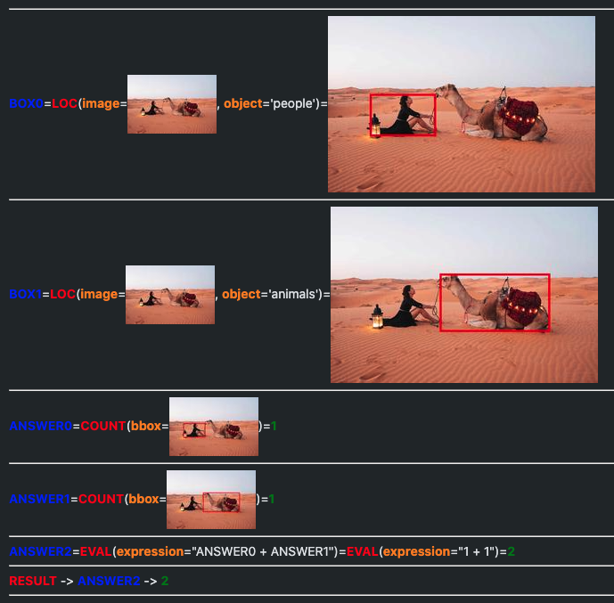
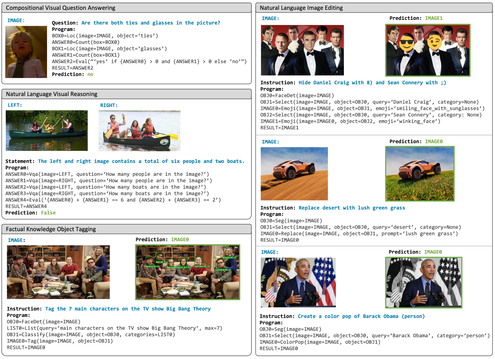
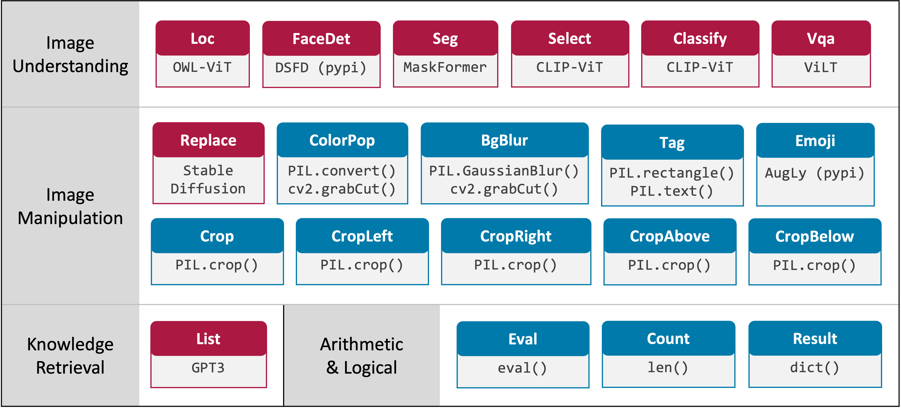

# Visual Programming: Compositional visual reasoning without training (CVPR 2023)
By [Tanmay Gupta](http://tanmaygupta.info/) and  [Aniruddha Kembhavi](https://anikem.github.io/)

[ [Project Page](https://tanmaygupta.info/visprog/) | [Arxiv Paper](https://arxiv.org/abs/2211.11559) | [Blog](https://blog.allenai.org/visual-programming-ca58c7af51cd) ]


This repository contains the official code for VisProg - a neuro-symbolic system that solves complex and compositional visual tasks given natural language instructions. VisProg uses the in-context learning ability of GPT3 to generate python programs which are then executed to get both the solution and a comprehensive and interpretable rationale. Each line of the generated program may invoke one of several off-the-shelf computer vision models, image processing routines, or python functions to produce intermediate outputs that may be consumed by subsequent parts of the program.

This code base has been designed to be:

:white_check_mark: easy to use (a simple ipynb per task) <br>
:white_check_mark: easy to extend with *new functionality* by adding new modules to VisProg <br>
:white_check_mark: easy to extend to *new tasks* by adding in-context examples for these tasks <br>
:white_check_mark: minimal and modular to make it easy to dig into and build upon

# Install Dependencies
```
conda env create -f environment.yaml
conda activate visprog
```

# Running the notebooks
Having setup and activated the conda environment, you should be all set to run the notebooks in the `notebooks/` folder. If you use an editor like VSCode, openning the `.ipynb`s within VSCode might be the easiest way to get started. 

You will find a notebook for each of the following tasks, but they are quite similar in structure:
- Outside knowledge object tagging: [`notebooks/ok_det.ipynb`](notebooks/ok_det.ipynb)
- Natural language image editing: [`notebooks/image_editing.ipynb`](notebooks/image_editing.ipynb)
- NLVR: [`notebooks/nlvr.ipynb`](notebooks/nlvr.ipynb)
- GQA: [`notebooks/gqa.ipynb`](notebooks/gqa.ipynb)

Simply, enter your OpenAI API key in the cell that currently reads `<Enter your key here>` and run the notebook. The notebooks are designed to be self-contained and should run end-to-end without any additional setup.

The basic structure of the notebooks is as follows:
- Setup paths
- Set OPENAI_API_KEY environment variable to use GPT3
- Import `ProgramGenerator` and `ProgramInterpreter` classes
- Import `PROMPT` (a text string containing in-context examples) or `create_prompt` (a function that creates the prompt on the fly)
- Create the `ProgramGenerator` and `ProgramInterpreter` objects
- Load the image or images to perform inference one
- Specify the natural language question / statement / instruction
- Generate program from the specified instruction using `ProgramGenerator`
- Interpret and execute program using `ProgramInterpreter`
- Visualize the returned result and visual rationale (execution trace)

# Example Output
We have tried to make it easy to visualize each step of the execution trace. 

For instance, when running the `gqa` notebook for the instruction `How many people or animals are in the image?` on `assets/camel1.png`, you should see the following outputs:

### Program
```python
BOX0=LOC(image=IMAGE,object='people')
BOX1=LOC(image=IMAGE,object='animals')
ANSWER0=COUNT(box=BOX0)
ANSWER1=COUNT(box=BOX1)
ANSWER2=EVAL(expr="{ANSWER0} + {ANSWER1}")
FINAL_RESULT=RESULT(var=ANSWER2)
```

### Visual Rationale


# Adding new functionality and ability to solve new tasks
- Add new modules for enabling these functionalities to [`engine/step_interpreters.py`](engine/step_interpreters.py). Don't forget to register these modules in `register_step_interpreters` function in the same file. 
- Add your in-context examples to a new file `prompts/your_task_or_dataset_name.py`. Note that instead of using in-context examples to generate programs, you may experiment with different ways of prompting such as providing function signatures and docstrings without needing to change the code at all!
- You can now play with examples from this dataset using a notebook similar to those in the `notebooks/` folder or create a python script to run inference on a large number of examples.

# Here's what VisProg can do today


# A summary of currently available modules


*Note that we have replaced ViLT for VQA with a more performant model called BLIP which was recently made available on Huggingface. This shows how easy it is to swap out or upgrade modules in VisProg.

# Changes since the version used in the CVPR paper
- GPT3 upgraded to `text-davinci-003` from `text-davinci-002`
- VQA module upgraded from ViLT to the more performant BLIP
- Changed the implementation of CLASSIFY and SELECT modules that use CLIP to use cosine similarity instead of dot product (which is the default score provided by Huggingface's CLIP model)

# Citation
If you find this code useful in your research, please consider citing:
```
@article{Gupta2022VisProg,
  title={Visual Programming: Compositional visual reasoning without training},
  author={Tanmay Gupta and Aniruddha Kembhavi},
  journal={ArXiv},
  year={2022},
  volume={abs/2211.11559}
}
```
